<div align="center">

<picture>

<source 
media="(prefers-color-scheme: dark)"
srcset="./assets/dark.svg">

<source 
media="(prefers-color-scheme: light)"
srcset="./assets/light.svg">



</picture>

</div>


<h1 align="center">
Hi 👋 I'm Aditya Saxena
</h1>


<h3 align="center">
Full Stack Developer | Java | Node.js | Backend Developer
</h3>


<p align="center">

Building scalable web applications with clean architecture,
efficient backend systems, and modern user experiences.

</p>


---

## 👨‍💻 About Me

- 💻 Full Stack Developer passionate about building real-world applications
- 🚀 Focused on backend development and scalable systems
- 🧠 Strong foundation in Data Structures & Algorithms
- 🔥 Interested in System Design and Cloud Technologies
- ⚡ Writing clean, maintainable, and efficient code


---

# 🛠️ Tech Stack


## 👨‍💻 Languages

<p>


</p>


## ⚙️ Backend

<p>


</p>


## 🎨 Frontend

<p>


</p>


## 🔧 Tools

<p>


</p>


---

# 🚀 Featured Projects


## 🌍 WanderLust

A full-stack property booking platform inspired by Airbnb.

### Tech Stack

```text
Node.js
Express.js
MongoDB
EJS
Cloudinary
Passport.js
Bootstrap
